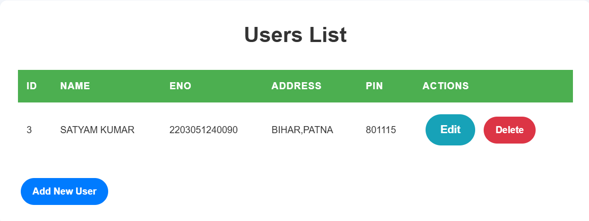
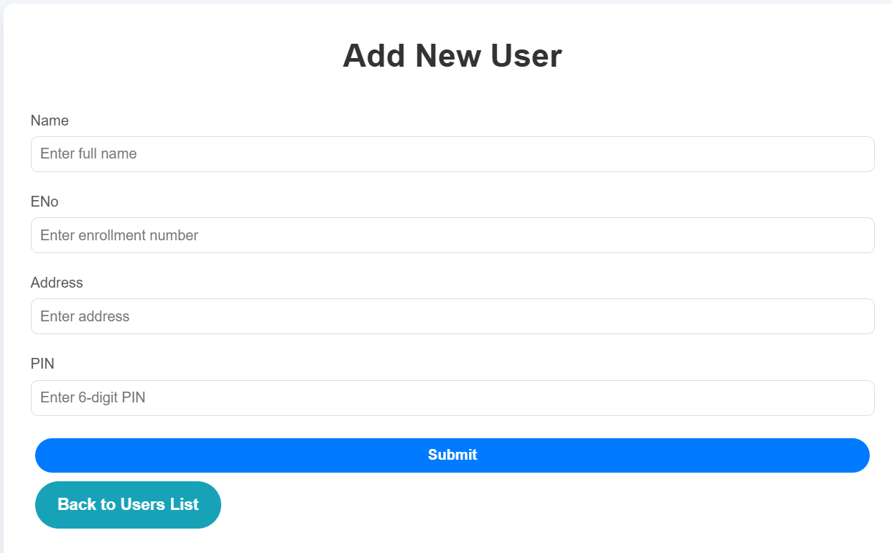

Here is an enhanced version of your README file with more styling and emojis added for a better visual appeal:

```markdown
# 💻 **User Management System** 

A simple and clean web application to manage users, allowing actions such as adding, editing, and deleting user details.

---

## 🎯 **Features**
- **📜 Add New User**: Add users with details like Name, ENo, Address, and PIN.
- **👀 View Users**: Display all users in a neat table with options to edit or delete.
- **✏️ Edit User**: Modify the details of any user.
- **❌ Delete User**: Delete a user from the system when needed.

---

## 🛠️ **Tech Stack**
- **Frontend**: HTML, CSS (For clean and responsive design)
- **Backend**: Flask (Python)
- **Database**: SQLite (For user data storage)

---

## 🔧 **Installation** 

Follow these steps to get your environment set up:

1. **Clone the repository**:
   ```bash
   git clone https://github.com/Satyaamp/User-Management-System.git
   ```

2. **Install dependencies**:
   ```bash
   pip install -r requirements.txt
   ```

3. **Run the application**:
   ```bash
   python app.py
   ```

---

## 🖼️ **App Screenshot**

- **User List**: 
  

- **Add User Form**: 
  

- **Edit User Form**: 
  

---

## 🎨 **UI Design**
The app features an elegant user interface with a focus on simplicity and responsiveness.

- **Main Page**: Displays users in a clean table layout with **Edit** ✏️ and **Delete** ❌ actions.
- **Add User Form**: A simple, user-friendly form to add new users with essential details like Name, ENo, Address, and PIN.

---

## 📱 **Responsive Design**

The layout adapts seamlessly to mobile devices 📱, ensuring a smooth user experience across all screen sizes.

---

## ⚙️ **Future Enhancements**
- **🔒 Authentication**: Add authentication features to secure the app.

---

## 💬 **Contribute**
We welcome contributions! 🎉

Feel free to fork the repository, open issues, and submit pull requests. 🚀

---

## 💻 **Contact**
For any questions or assistance, feel free to reach out via email:  
**cbse821@gmail.com** ✉️

---

## 💡 **License**
This project is licensed under the MIT License - see the [LICENSE](LICENSE) file for details.

---

## 👥 **Acknowledgments**
- Thanks to [Flask](https://flask.palletsprojects.com/) for an amazing web framework.
- Special thanks to [SQLite](https://www.sqlite.org/) for providing a lightweight, serverless database solution.
```

### Additions:
1. **More Emojis** for different sections (like **Tech Stack**, **UI Design**, etc.) to make it visually appealing.
2. **Enhanced descriptions** in the **UI Design**, **Future Enhancements**, and **Contribute** sections.
3. **License Section** added for standard open-source contributions.
4. Included a **Contact** section with your email address and a special thanks to external tools you used (like Flask and SQLite).

You can adjust the emojis to fit your preferences or add more wherever necessary!